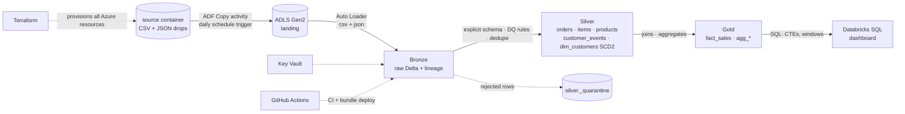

# End-to-End Azure Data Pipeline (ADF + Databricks + Delta Lake)

**Python · SQL · PySpark · Azure Data Factory · Databricks · ADLS Gen2 · Delta Lake · Terraform · GitHub Actions**

Raw **CSV and JSON** files are ingested by **Azure Data Factory** (scheduled trigger) into
**ADLS Gen2**, picked up incrementally by **Databricks Auto Loader**, and refined through a
**Medallion (Bronze → Silver → Gold)** architecture of **Delta** tables. Business questions are answered
with **SQL (CTEs, joins, window functions)** on the Gold layer. Everything is provisioned with
**Terraform** and shipped through **GitHub Actions**.

## Architecture



Schedule: ADF trigger **02:00 IST** → Databricks Workflow **02:30 IST**.

## What this project demonstrates

| Area | Implementation |
|---|---|
| Ingestion (ADF) | ADF pipeline with Copy activity (retries, managed identity) from `source` to ADLS `landing`, plus a **daily schedule trigger** (all in Terraform) |
| CSV **and JSON** | Shop data as CSV; clickstream as newline-delimited JSON with a nested `context` object that is flattened in Silver |
| Incremental load | Auto Loader (`cloudFiles`) with checkpoints, schema evolution, `availableNow` trigger |
| Medallion | Bronze (raw + lineage) → Silver (typed, validated, deduplicated) → Gold (fact + aggregates) |
| **Schema enforcement** | Explicit `StructType` per Silver table (`src/schemas.py`); `try_cast` so bad types become NULL instead of crashing |
| **Data quality** | Named rules for **nulls, duplicates, type/range/allowed-value validation**; failures go to a quarantine table with the rule names |
| Upserts & history | Idempotent Delta `MERGE`; **SCD Type 2** customer dimension via hash-diff |
| **SQL analytics** | `sql/analytics_queries.sql`: 9 queries using CTEs, joins, `SUM/AVG OVER`, `ROWS` frames, `LAG`, `ROW_NUMBER`, `DENSE_RANK`, `NTILE`, point-in-time SCD2 join |
| Orchestration | Databricks Workflow defined as code (Asset Bundles, dev/prod) |
| Engineering practice | Pure, unit-tested PySpark transforms; every SQL query executed in CI; `ruff`; `terraform validate` |
| Security | Managed identity (ADF), service principal + secret scope (Databricks), Key Vault, no secrets in code |

## Repo layout

```
├── infra/terraform/        # RG, ADLS Gen2, ADF (+pipeline, trigger), Databricks, Key Vault, SP/RBAC
├── infra/adf/              # ADF pipeline activities (JSON)
├── data_generator/         # CSV + JSON generator (batch 1 initial, batch 2 changes + dirty data)
├── notebooks/              # 00_setup · 01_bronze · 02_silver · 03_gold
├── src/                    # transforms · schemas · scd2 · delta_utils · config
├── tests/                  # 12 pytest tests incl. executing every analytics SQL query
├── sql/                    # analytics_queries.sql (CTE/window) · dashboard_queries.sql
├── databricks.yml          # Asset Bundle: job, clusters, dev/prod targets
└── .github/workflows/      # ci.yml · deploy.yml
```

## Run it

### 1. Local: generate data, lint, test
```bash
python data_generator/generate_data.py --out data/raw --batch 1
pip install -r requirements-dev.txt
ruff check . && pytest -q          # needs Java 17
```

### 2. Provision Azure
```bash
az login
cd infra/terraform && terraform init && terraform apply
```
Outputs: storage account, Databricks URL, Key Vault, **Data Factory name**.
> Role assignments need Owner / User Access Administrator on the subscription.

### 3. Databricks secrets (service principal for ADLS)
```bash
databricks secrets create-scope adls
databricks secrets put-secret adls sp-client-id
databricks secrets put-secret adls sp-client-secret
databricks secrets put-secret adls sp-tenant-id
```
(Values are in Key Vault; read them with `az keyvault secret show`.)

### 4. Ingest with ADF
```bash
./scripts/upload_to_adls.sh <storage_account>          # drops files into the `source` container
```
In the Azure portal open **Data Factory Studio → pl_ingest_raw_to_landing → Trigger now**
(or activate `tr_daily_0200_ist` for the daily schedule). Files appear under `landing/retail/<entity>/`.

### 5. Run the lakehouse
```bash
# edit databricks.yml -> workspace host
databricks bundle deploy -t dev --var storage_account=<storage_account>
databricks bundle run retail_lakehouse_pipeline -t dev
```

### 6. Prove incremental + SCD2 + data quality
```bash
python data_generator/generate_data.py --out data/raw --batch 2
./scripts/upload_to_adls.sh <storage_account>
# trigger ADF again, then re-run the Databricks job
```
Only new files are processed. Check `silver._quarantine`, `silver.dim_customers` (history rows) and
run `sql/analytics_queries.sql` in Databricks SQL.

> **No Azure / Databricks trial only?** Leave `storage_account` empty: notebooks use Unity Catalog Volumes
> and you can upload files straight into the volume (skipping ADF).

## Design decisions (interview talking points)
* **Bronze is all strings** so schema drift never breaks ingestion; **Silver enforces explicit schemas**.
* **`try_cast` + rules** → a bad type becomes NULL and is quarantined, never a job failure (works with ANSI mode on).
* **Quarantine rather than drop/fail** – bad data is auditable and reprocessable.
* **Idempotent Silver** – dedupe + MERGE, so re-running a failed job creates no duplicates.
* **ADF only moves files** (Copy activity, managed identity); Databricks does all transformation.
* **Pure transform functions** – testable on a laptop and in CI without a cluster.

## Testing: what has and hasn't been validated
* ✅ Unit tests on local Spark (transforms, DQ rules, schema enforcement, nested JSON, funnel, SCD hashing)
* ✅ Every query in `sql/analytics_queries.sql` is executed in CI on generated data
* ⚠️ Auto Loader, Delta `MERGE`/SCD2, ADF and Terraform need a real Azure/Databricks environment – run the steps above once before relying on them.

## Limitations / next steps
* Silver re-reads full Bronze each run (fine at this scale); next: Change Data Feed or streaming `foreachBatch`.
* ADF triggers are separate from the Databricks schedule; production would chain them (ADF Databricks Job activity).
* Add Great Expectations / DLT expectations, monitoring/alerts and a Power BI report.

## Resume entry

**End-to-End Azure Data Pipeline (ADF + Databricks + Delta Lake)**
*Python, SQL, PySpark, Azure Data Factory, Databricks, ADLS Gen2, Delta Lake, Terraform*
* Built an **Azure Data Factory** pipeline with a scheduled trigger to ingest raw **CSV and JSON** files into **ADLS Gen2**, provisioned as code with Terraform.
* Designed a **Medallion architecture**: Bronze (raw), Silver (cleaned, deduplicated) and Gold (aggregated) **Delta** tables, with incremental loads via Databricks **Auto Loader**.
* Applied **PySpark** transformations, **explicit schema enforcement** and data-quality checks (nulls, duplicates, type validation) with a quarantine table for rejected records; implemented an **SCD Type 2** dimension.
* Used **SQL** on Gold tables to answer business questions with joins, **CTEs and window functions** (running totals, moving averages, LAG, ranking, NTILE); added unit tests and **CI/CD** with GitHub Actions.
